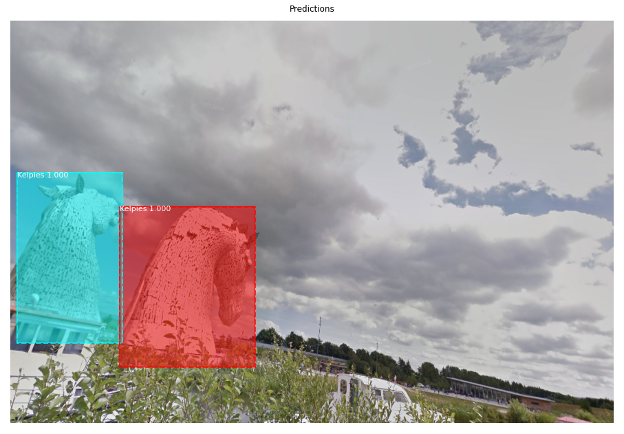

# Welcome

Personal website for Arran Brown, to showcase project work. 

# Contact Information

Github: 
[arranbrown99](https://github.com/arranbrown99)

Email: [arranbrown99@gmail.com ](arranbrown99@gmail.com )

Mobile: 07541 100371

Linkedin: [arran-brown99](www.linkedin.com/in/arran-brown99)

# Projects

## Glaros

### 3rd year group project

A Multi-cloud dynamic service, or cloud as a platform, Glaros will migrate itself & payload throughout AWS, Azure and GCP instances, rehosting a web server on the new cloud service provider.

Glaros uses stock market data to decide when to move between cloud services leaving no trace behind after moving.

Software engineering best practices were used to improve our workflow.
We worked with our client [Leidos](https://www.leidos.com/) to iterate on the design regularly.

[Link to repository](https://github.com/arranbrown99/Glaros)

## This Place looks Familiar

### 4th year individual project. 

Using deep learning and neural networks to detect Scottish landmarks from within photographs. 
A novel project as there is a focus of detecting these landmarks in panoramas.
A focus on academic research and the resulting dissertation. 

Still in progress.

## Gradinator

[Link to repository](https://github.com/arranbrown99/Gradinator)

## COVID Simulation

Using VIRL in order to write a learning agent, an AI which can choose the best actions each week of a COVID-19 simulation.

Various agents were implemented including Q-learning, and Q-learning with a neural network for parameter optimistion as well as policy search.

[Link to repository](https://github.com/arranbrown99/COVID_simulation)

